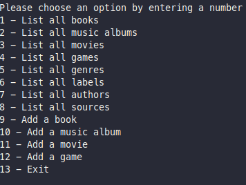

 

# Ruby Group Capstone - Catalog of Things

In this project, the console app that helps to keep a record of different types of things that somebody won: books, music albums, movies, and games.
The data is stored in JSON files but the correspding schema is prepared with tables structure analogical to the program's class structure.

## Video Description
https://user-images.githubusercontent.com/69616245/170808251-65739934-4ed0-4641-9dd9-5f4b27644846.mp4

## How to build the "Catalog of my things" app

"Catalog of my things" is a simple console app that allows users to manage collections of the things they own. It should be based on the following UML class diagram.

  

## User interface

  

## Built with

    - Major languages: Ruby
    - Technologies used: Rubocop, RSpec, Gitflow

## Prerequisites

    - Ruby installed on local system
    - npm ( Node Package Manager )
    - Git and Github Account

## Getting Started

To get a local copy up and running follow these simple example steps.

- Open terminal
- Change to the desired directory then run the following:

  - Run `git@github.com:mengiefen/Catalog-of-things.git`

  - cd repo-name/ 
## Running the Application
>**Steps to excute the app locally**

    - `main.rb` is the entry point for the app
    -  On root directory run `chmod 755 main.rb`
    -  Then run `./main.rb` 
    -  Follow the interactive console instructions
  
## Contributers

👤 **Mengstu Fentaw**

- Github: [@mengiefen](https://github.com/mengiefen)
- Twitter: [@MengistuFentaw](https://twitter.com/MengistuFentaw)
- Linkedin: [Mengstu Fentaw](https://www.linkedin.com/in/mengefen/)

👤 **Mauro Vasconcelos**

- GitHub: [@vanillainanutshell](https://github.com/vanillainanutshell)
- Twitter: [@vanillainanutshell](https://www.linkedin.com/in/vanillainanutshell/)
- LinkedIn: [LinkedIn](https://www.linkedin.com/in/vanillainanutshell/)

👤 **Andres Condezo Monge**

- GitHub: [@andres-condezo](https://github.com/andres-condezo)
- LinkedIn: [Andres Condezo Monge](https://www.linkedin.com/in/andres-condezo/)

👤 **Hemerson Foreste**

- GitHub: [@ForHemer](https://github.com/ForHemer)
- Twitter: [@HemersonForeste](https://twitter.com/HemersonForeste)
- LinkedIn: [LinkedIn](https://linkedin.com/in/hemerson-foreste-890685197)

## 📝 License

This project is [MIT](./MIT.md) licensed.
